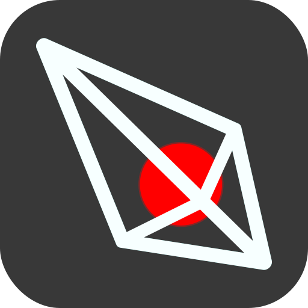

Arrow
=====

***The Game Narrative Design Tool***

[Download](#download) | [Runtimes](#runtime-projects) | [Web App](#web-app) | [Guides](#guides)

Arrow is the free, open-source and feature-rich tool for
*game narrative* design, *text-adventure* development,
and creation of *interactive nonlinear storytelling* documents.

![Arrow's Overall Look][arrow-screenshot]

Notable Features:

+ Free as in Freedom
+ 100% Visual Development
+ Advanced Node System
+ VCS-Friendly Save Files
+ Support for Distributed Workflows
+ One-Click Playable Export (HTML)
+ CSV (I18n) Export
+ Unicode (with RTL, CJK and CTL) Support
+ Continuum Safety

Arrow supports a rich palette of features, from scenes and macros, to variables and characters.
It also comes with built-in common node types, providing logic, interactive navigation, random data generation,
state management, and more.

> Check out [Guides](#guides) for detailed information.

## Download

Arrow prebuilt executables are available to download from the archive of [releases].

Following links are to the *fairly stable most recent* versions:

+ Linux (X11) [x86_64 (64-bit)][linux-x11-x86-64-latest]
+ Windows [64-bit][win-64-latest]

> For other platforms and architectures, or to take advantage of the latest features in the main branch
> consider [building or running Arrow from source][wiki-build-from-source].

## Web App

Arrow is also available as a [Progressive Web App][web-app].

The app tries to provide the core features on a par with the most recent downloadable releases.  
The most critical difference is that ***it stores project data and configurations in your browser***.  
Additional import & export conveniences are available to ease working with file-system of your device.

> **Note!**  
> Due to the nature of browsers, **certain features may be limited or not available in web app** versions.  
> We *highly recommend prioritizing use of Arrow for desktop (OS platforms)* whenever possible.  
> Currently known limited features on browsers include:
> loading fonts from the user's system (affecting Unicode support), window management conveniences and incremental exports.  

> PWA version requires your browser to have `WebGl` and `Canvas` element support,
> available `Web-Storage`, and `Java-Script` enabled (which any *modern browser* does by default).

> The experience is optimized for medium-large screens.

## Runtime Projects

+ [Official HTML-JS Runtime][runtime-html-js]
    > Bundled with Arrow, this runtime is used in playable exports.

## Guides

Docs for Arrow are available in the [repository's Wiki][wiki-home],
including a [Quick Start Guide][wiki-quick-start-guide] as well as,
detailed instructions, documentation of the built-in nodes, and more.

## Licenses

Copyright (c) 2021-present Mor. H. Golkar and contributors

Unless otherwise specified, Arrow and files in this repository are
available under `MIT` license.
See [license][license-file] & [copyright][copyright-file] files for more information.

Have a Good Time

<!-- Download -->
[releases]: https://github.com/mhgolkar/Arrow/releases
[linux-x11-x86-64-latest]: https://github.com/mhgolkar/Arrow/releases/download/v3.0.0/Arrow-v3.0.0-linux-x86_64.tar.gz
[win-64-latest]: https://github.com/mhgolkar/Arrow/releases/download/v3.0.0/Arrow-v3.0.0-win.64.zip
<!-- PWA -->
[web-app]: https://mhgolkar.github.io/Arrow/
<!-- Wiki -->
[wiki-home]: https://github.com/mhgolkar/Arrow/wiki/
[wiki-build-from-source]: https://github.com/mhgolkar/Arrow/wiki/build-from-source
[wiki-quick-start-guide]: https://github.com/mhgolkar/Arrow/wiki/quick-start-guide
<!-- Relative -->
[runtime-html-js]: ./runtimes/html-js/
[license-file]: ./license
[copyright-file]: ./copyright
<!-- Resources -->
[arrow-screenshot]: https://mhgolkar.github.io/Arrow/media/overview.v3.png
